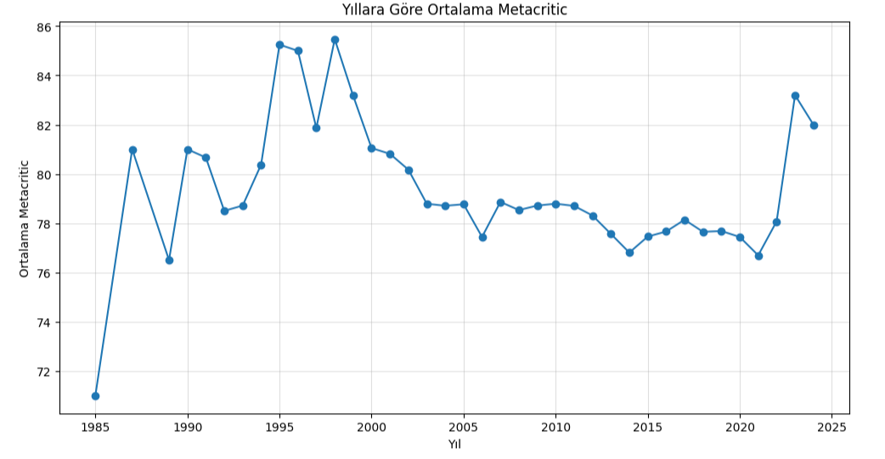
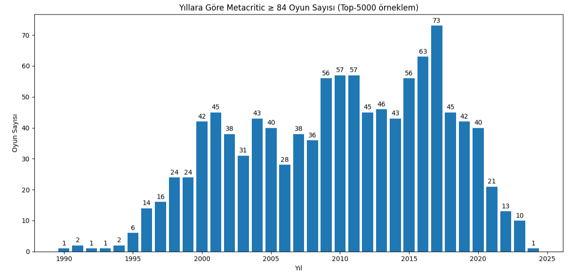
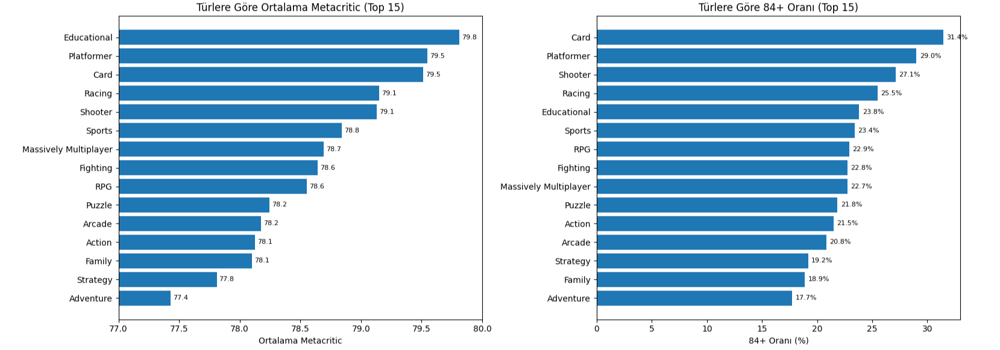
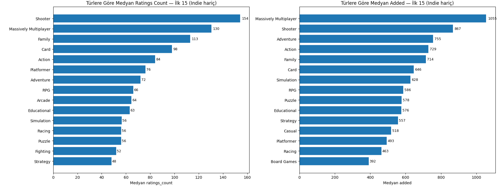
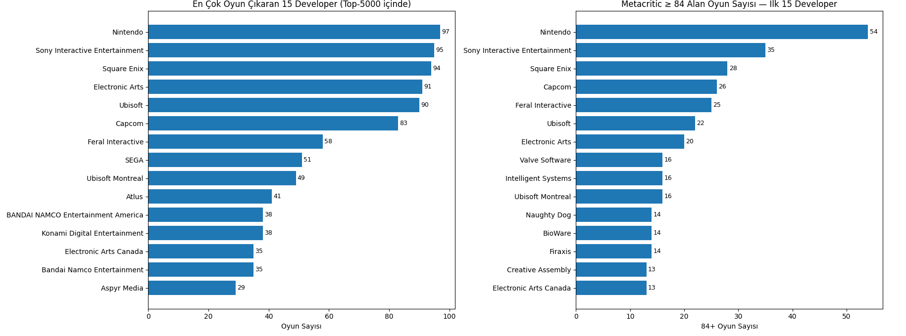
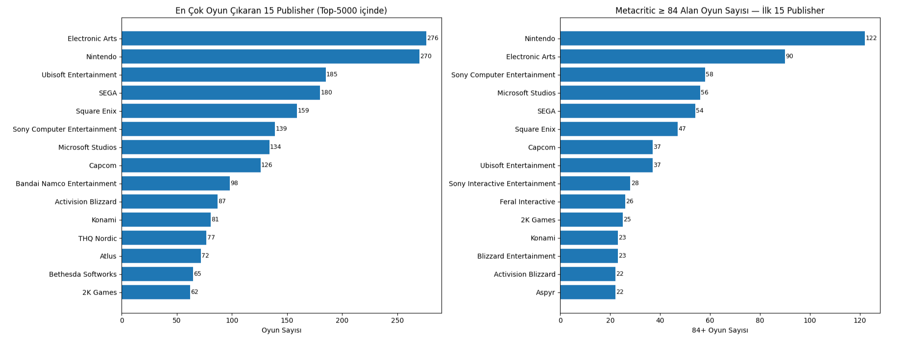
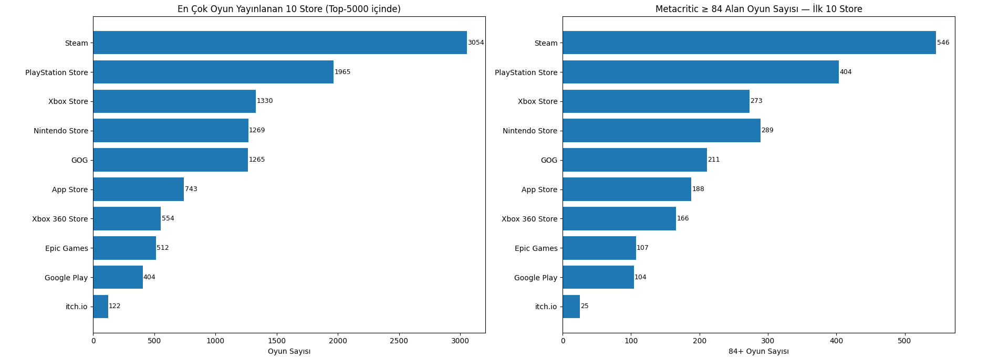

# 🎮 Game Market Analysis

## 📌 Project Overview
This project was created to **analyze the video game market before developing a new game**.  
The goal is to understand **genre, platform, developer, and publisher breakdowns**, evaluate quality distribution, user interest, and market trends — in order to make strategic decisions for a successful game release.

---

## 🛠 Tools Used  

| Tool / Technology | Purpose |
|-------------------|---------|
| **Python** | Data collection, processing, and analysis |
| **Jupyter Notebook** | Interactive exploration and visualization |
| **Pandas & NumPy** | Data manipulation and numerical analysis |
| **Matplotlib & Seaborn** | Data visualization |
| **Requests API** | Data collection from RAWG API |

---

## 🔍 Methods Used  

- Data collection from **RAWG API** (Top 5000 games by Metacritic score)  
- Yearly trend analysis (average Metacritic scores, high-quality game counts)  
- Genre analysis (average Metacritic, share of 84+ games, user attention metrics)  
- Developer and publisher segmentation (volume vs. quality)  
- Store analysis (distribution of games across platforms/stores)  

---

## 📂 Repository Structure  

- 📓 **Game_Market_Analysis_TR.ipynb** : Turkish Jupyter Notebook containing the analysis and modeling steps  
- 🐍 **Game_Market_Analysis_TR.py** : Python script version of the notebook  
- 📓 **Game_Market_Analysis_EN.ipynb** : English Jupyter Notebook containing the analysis and modeling steps  
- 🐍 **Game_Market_Analysis_EN.py** : Python script version of the notebook  
- 📊 **rawg_5000_games.csv** : Dataset file extracted via RAWG API (top 5000 games by Metacritic)  
- 📄 **README.md** : Project description and documentation  
- 📸 **/screenshots/** : Folder containing key analysis charts (for README visualization)  

- 🇹🇷 [`Game_Market_Analysis_TR.ipynb`](Game_Market_Analysis_TR.ipynb) : Turkish Jupyter Notebook containing the analysis and modeling steps   
- 🇹🇷 [`Game_Market_Analysis_TR.py`](Game_Market_Analysis_TR.py) : Python script version of the notebook 
- 🇺🇸 [`Game_Market_Analysis_EN.ipynb`](Game_Market_Analysis_EN.ipynb) : English Jupyter Notebook containing the analysis and modeling steps  
- 🇺🇸 [`Game_Market_Analysis_EN.py`](Game_Market_Analysis_EN.py) : Python script version of the notebook  
- 📊 [`Companies.csv`](Companies.csv) : CSV file extracted and created from Wikipedia data
- 📄 [`README.md`](README.md) : Project description and documentation  
---

## 📊 Key Findings  

- **Pandemic effect:** Average Metacritic scores increased after 2020, but the **number of 84+ top-tier games decreased**.  
- **By genre:** *Card, Platformer, Shooter* genres show the highest success ratios.  
- **By developer:** *Nintendo* nearly doubled its rivals in the number of 84+ games released.  
- **By publisher:** While *Nintendo* and *Microsoft* show both high volume and high quality, some high-volume publishers with lower 84+ ratios could be easier partners for indie developers.  
- **By store:** *Steam* dominates in volume; however, considering workload vs. return, a suggested order is:  
  1. **PC (Steam / Epic Games)**  
  2. **Nintendo or Xbox**  
  3. **PlayStation** (requires stronger publisher partnership)  

---

## 💡 Recommendations  

- Treat **84+ Metacritic** as a strategic target for game development.  
- Focus on genres with proven high success (*Card, Platformer, Shooter*).  
- Avoid launch windows dominated by **Nintendo / Sony flagship releases**.  
- For publishing partnerships: prioritize **mid-volume, high-ratio publishers** (balanced opportunity).  
- Phase store releases to manage workload: start with PC, expand to consoles later.  

---

## 📸 Screenshots  

### Average Metacritic by Year  
  

### 84+ Games by Year  
  

### Genres – Average Metacritic & 84+ Share  
  

### Genres – User Interest (ratings_count & added)  
  

### Developer Analysis  
  

### Publisher Segmentation  
  

### Store Analysis  
  

---

## 📑 Dataset Summary  

- Source: [RAWG Video Games Database API](https://rawg.io/apidocs)  
- Dataset size: **5000 games**, ranked by Metacritic score  
- Key variables:  
  - `metacritic_x` → Metacritic score  
  - `genres` → Game genres  
  - `developers`, `publishers` → Developers & publishers  
  - `stores` → Platforms/stores released on  
  - `ratings_count`, `added` → User attention metrics  

---

## 🕹 Closing Note  

Game development is not only strategy and data, but also **passion**.  
For enthusiasts, we’ve included a special list of **95+ Metacritic “unforgettable classics”**, as inspiration for future projects.  
